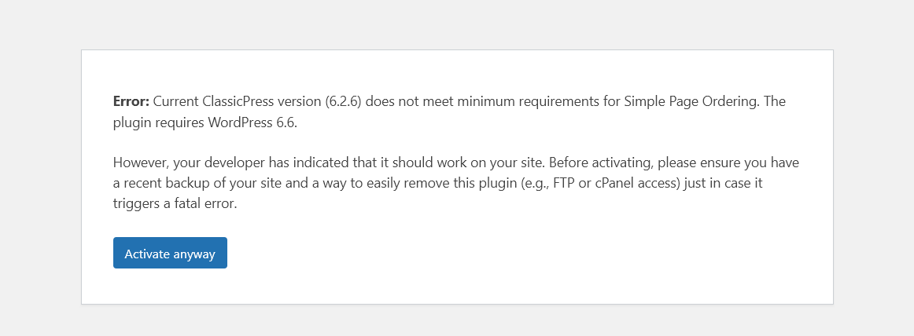
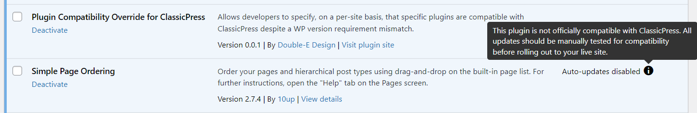

# Plugin Compatibility Override for ClassicPress

Many WordPress plugins list a minimum version that is higher than the version that ClassicPress officially supports, but in some cases the plugin does work perfectly fine. This plugin enables developers to specify such plugins on a per-site basis, allowing them to be activated and used in ClassicPress.

> [!CAUTION]
> This is a very new plugin that hasn't been widely tested. Use it at your own risk, ensuring you have backups and a quick way to recover from fatal errors.

## What it does
- Checks the list of specified plugins for incompatibility based on WP version requirements (the same way ClassicPress does) and ignores them if they are found to be compatible
- For confirmed officially incompatible plugins:
	- Enables the activation link in the plugins list for specified plugins
	- Adds a message and button to the activation error screen explaining the compatibility situation and offering the option to force activation
	- Re-attempts activation via AJAX request when the "activate anyway" button is clicked, which:
		- temporarily overrides the `$wp_version` global variable to spoof the WordPress version for compatibility checks during activation
		- redirects to the plugin page afterwards (this method prevents default behaviour of `plugins.php` from causing infinite loops)
	- Disables automatic updates (for safety if future incompatibilities arise - updates should be manually tested), including removing the link in the admin plugins list and showing an explanation in its place.




## What it does not do
- Perform any actual compatibility testing or validation
- Deactivate incompatible plugins when this plugin is deactivated
- Override PHP version compatibility checks.

## How to use
This plugin provides a filter hook `cp_plugin_compatibility_overrides` that allows you to specify plugins that should be considered compatible with ClassicPress for your specific project.

An example of how to configure plugin compatibility overrides in your own plugin is shown below.

```php
class ClassicPressHandler {

	public function __construct() {
		add_filter('cp_plugin_compatibility_overrides', [$this, 'assert_plugin_compatibility']);
	}

	public function assert_plugin_compatibility($overrides) {
		$overrides[] = 'simple-page-ordering/simple-page-ordering.php';

		return $overrides;
	}
}
```


